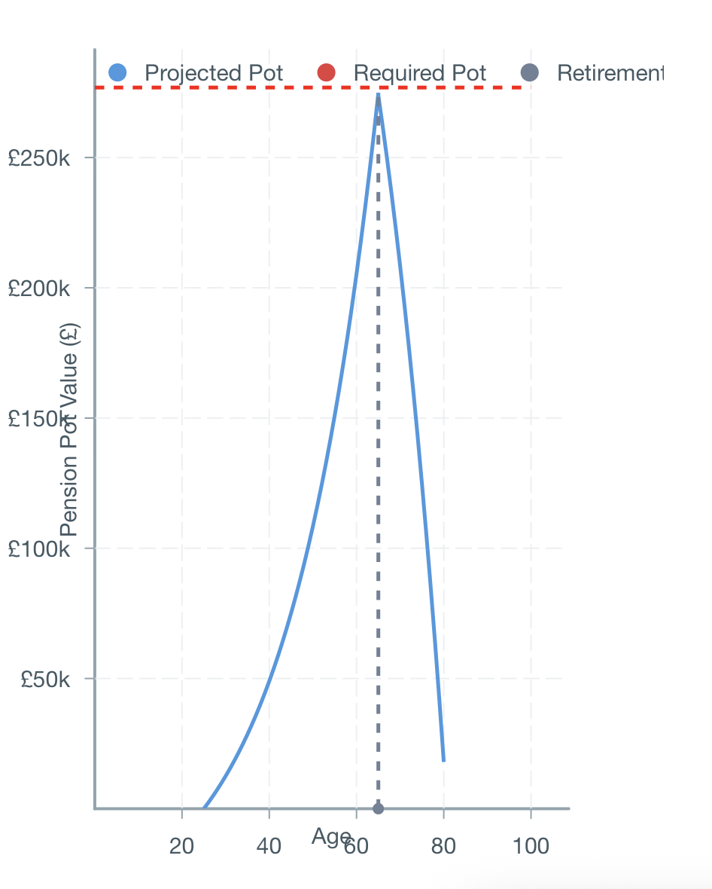

# Frontend Developer Tech Test

## Retirement Planning Calculator

This is a React-based retirement planning application that helps users visualise their pension pot growth and retirement income projections. It’s essentially a financial planning tool for retirement.




## Running the App

This application has been built using Vite. You can simply:

1. Install packages with `npm install`  
2. Run the app with `npm run dev`

## Technology Stack

- React 19 with TypeScript  
- Vite  
- Formik for form management  
- Victory.js for data visualisation  

## Project Structure

- `src/components/RetirementForm.tsx` – Main form component  
- `src/components/RetirementChart.tsx` – Chart visualisation  
- `src/lib/calculations.ts` – Core financial calculations  
- `src/lib/chartCalculations.ts` – Data processing for charts  
- `src/lib/config.ts` – Configuration constants  

## Method

My main motivation in deciding the structure of this codebase was readability and maintainability. I aimed for a clear and concise folder structure that cleanly separates the different disciplines of the application.

Early on, I decided that a configuration file would be suitable, as the challenge includes a few fixed parameters:

- Annual return rate: 0.049 (4.9%)  
- Months in a year (to avoid "magic numbers")  
- Life expectancy: 81 (as per the challenge brief)  

These values are stored in a TypeScript enum:

```ts
enum Config {
  ANNUAL_RATE = 0.049,
  MONTHS_PER_YEAR = 12,
  LIFE_EXPECTANCY = 81,
}
```

For visualising the data, I chose Victory after some research. The syntax is simple, and the components are easy to maintain, adapt, and scale:

```tsx
<VictoryLine
  data={accumulationData.concat(decumulationData)}
  x="x"
  y="y"
  style={{
    data: { stroke: "#4299e1" },
  }}
/>
```

The `data` property is strongly typed for safety and clarity:

```ts
type ChartType = 'Projected Pot' | 'Required Pot' | 'Current Pots';

export interface ChartData {
  x: number;
  y: number;
  type: ChartType;
}
```

The calculations that power these charts are broken into:

### Chart-Specific Calculations

- `getAccumulationData` – Calculates pot growth during employment, including compound interest.  
- `getDecumulationData` – Models the drawdown after retirement, still factoring in compound growth on the remaining balance.  

### Generic Financial Calculations

- `calculateCompoundInterest` – A reusable utility for compound interest, improving readability and testability.  
- `potNeededForDesiredIncome` – Computes the target pot size needed to sustain a given retirement income.  

To power the form, I set initial values based on trial and error until I found a demonstrably "desirable" scenario:

```ts
const initialValues: RetirementFormValues = {
  desiredIncome: 25000,
  employerContribution: 135,
  personalContribution: 45,
  retirementAge: 65,
  currentAge: 25,
  currentPensionPots: 0,
};
```

## If I Had More Time

- Set up Prettier for consistent code formatting  
- Add styling for a more polished, mobile-friendly UI  
- Introduce Yup for robust form validation  
- Explore an "auto-optimisation" mode to suggest input values based on age, retirement age, and income goals  
